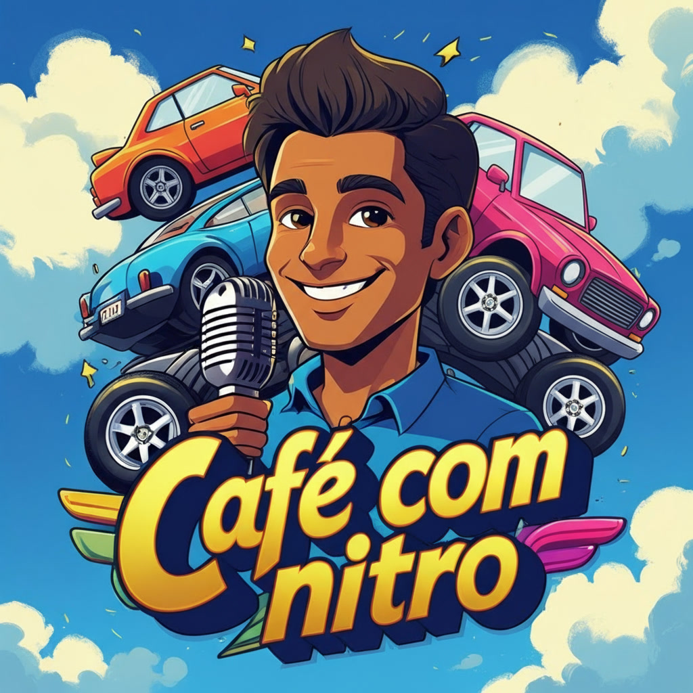

    Projeto de Podcast Criado com IAs Generativas

🎧 [Clique aqui para ouvir o episódio](output/podcast_editado.mp3)

## 💻 Tecnologias utilizadas

- Roteiro gerado via [ChatGPT](https://chat.openai.com/) 
- Imagem de capa gerada via [Leonardo.AI](https://app.leonardo.ai/)
- Audio gerado via [ElevenLabs](https://beta.elevenlabs.io/)
- Edição do áudio via [Capcut](https://www.capcut.com/pt-br/)

## 🧠 Prompts

## ChatGPT (Nome do Podcast)：
Você é um roteirista e deverá criar um podcast de conteúdo automotivo, focado em noticias e lançamentos sobre carros no mercado brasileiro. Nessa primeira etapa você terá que criar algumas ideias de títulos e subtítulos para o programa levando em consideração as regras:

- O nome deve ser enxuto, lembre-se de criar o titulo para o podcast e também um subtítulo
- Crie 10 ideias, tente ser mais descontraído e com tom mais humorístico
- Seja criativo e não se prenda somente a características simples dos carros, use também termos usados em corridas ou no meio de preparação de carros e motores, gírias do universo gearhead ou até nomes histórico, como de estradas e circuitos 
- Não seja exagerado e sem clickbait enganoso, transmita credibilidade e curiosidade.
- Não crie nomes com termos agressivos ou ofensivos a marcas
- Se atente a nomes de outros podcasts, programas automotivos ou mesmo quadros de canais do youtube e crie algo que não copie eles

## ChatGPT (Roteiro do Episodio):
Lembrando que você é um roteirista e está ajudando um podcast automotivo chamado "Café com Nitro - Um boost matinal nas atualizações automotivas do Brasil", crie um  roteiro para um episódio com esse formato:
[INTRODUÇÃO]
[CURIOSIDADE 1]
[CURIOSIDADE 2]
[FINALIZAÇÃO]

Siga essas regras:
- Crie o roteiro facilitando o seu uso no ElevenLabs, em formato de prompt e com tags entre as frases para tornar a fala mais realista, como: [sarcastically], [enthusiastically], [whispers], [giggles], [sighs], [confident tone] e outros, não use a tag [dramatic pause]
- O podcast será curto, não podendo ultrapassar os 4 minutos e será apresentado somente por uma pessoa
- Mantenha um tom humorístico, porém profissional, com explicações simples e claras, sem termos técnicos complexos ou em inglês
- no bloco [INTRODUÇÃO] substitua por uma introdução rápida com algum bordão que poderá ser repetido em todas as introduções dos episódios, falando o nome do podcast, o subtítulo e o nome do apresentador, que também deverá ser inventado
- no bloco [CURIOSIDADE 1] substitua por algum lançamento recente, procure por informações de motorização, preço e avaliações para criar um resumo sobre ele
- no bloco [CURIOSIDADE 2] crie um quadro no qual o apresentador está respondendo a uma pergunta de um telespectador sobre dicas para um novo carro de até 150 mil reais com cambio automático. Procure por opções no mercado e retorne 3 opções: uma de zero quilometro, uma de usado com boa confiabilidade e uma outra de usado, mas dessa vez com foco na dirigibilidade, inclusive será bom se o carro for conhecido por ter uma manutenção mais cara, faça um comentário em tom humorístico para essa opção
- no bloco [FINALIZAÇÃO] substitua por uma despedida em um tom meio "aah, já acabou?", repita o nome do podcast "Café com Nitro" e o mesmo nome do apresentador que você criou na introdução

Importante:
- O roteiro inteiro deve ser entregue já no formato completo, seguindo as tags de emoção e entonação que o ElevenLabs interpreta
- O texto deve soar natural, leve e divertido
- Não use termos em inglês
- Não use a tag [dramatic pause]

## Leonardo.ai (Imagem de Capa):
A vibrant cartoonish cover art image for a podcast about car news named Café com Nitro, featuring a stylized illustration of a guy smiling, dark hair, and a warm olive skin tone, holding a podcast style microphone, surrounded by colorful car elements, such as car wheels, exhaust pipes, and a giant coffee cup. The title is displayed prominently in bold, playful, golden lettering with a speedometer-inspired font, the entire scene is set against a bright blue sky with fluffy white clouds, conveying a sense of energy, excitement, and fun.

## 👨‍💻 Criado por

    
    
&nbsp&nbsp&nbspBruno Costa Marques 
    &nbsp&nbsp&nbsp
    <a 
        href="https://github.com/Brunelleshi">
        GitHub
    </a>
    &nbsp;|&nbsp;
    <a 
        href="https://www.linkedin.com/in/brucostamarques/">
        LinkedIn
    </a>
    &nbsp;|&nbsp;
    <a 
        href="https://www.youtube.com/@NoobEntusiasta">
        Youtube
    </a>
    &nbsp;|&nbsp;

